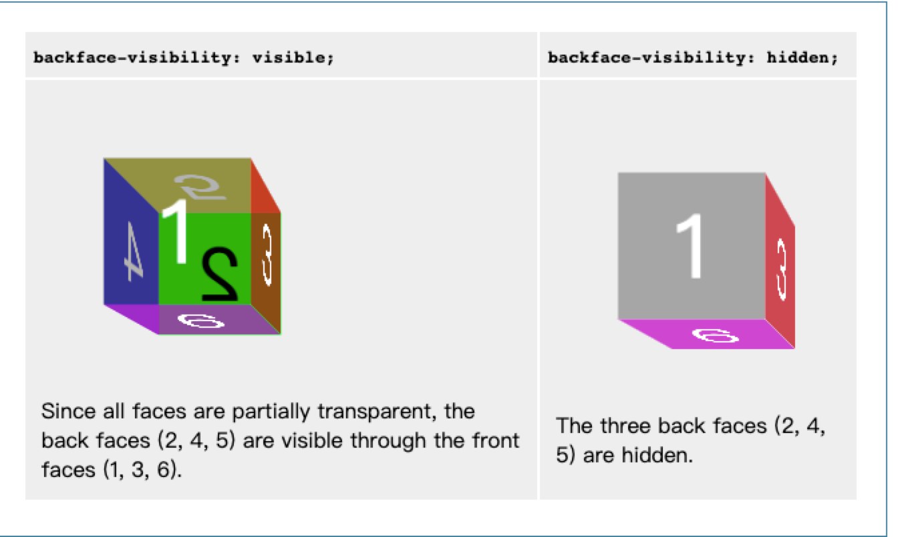
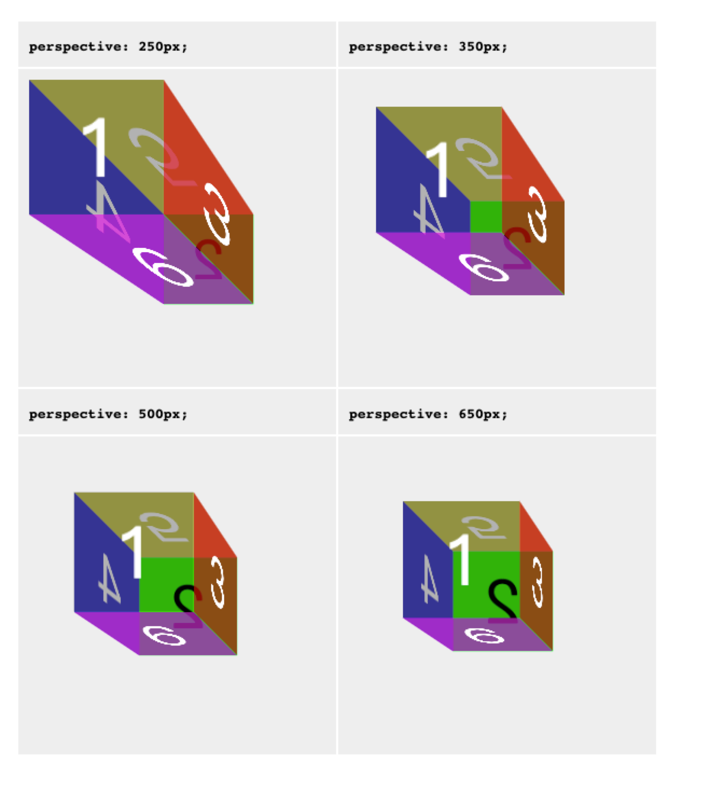

# 横向滚动

背景：在做横向滚动的时候，发现在 Android 下会出现横向滚动条的问题，设计说不是很好看，希望去除。

## css 样式

```css
.container-wrap {
    width: 100%;
    height: 50px;
    background-color: rgba(0,0,0,0.8);
    white-space: nowrap;
    overflow: hidden;
    overflow-x: scroll; /* 1 */
    -webkit-backface-visibility: hidden;
    -webkit-perspective: 1000;
    -webkit-overflow-scrolling: touch; /* 2 */
    text-align: justify; /* 3 */
    &::-webkit-scrollbar {
        display: none;
    }
}
```

主要利用 `overflow: hidden` 以及 `overflow-x: scroll` 使横向能够滚动。

### `white-space`

用来设置如何处理元素中的空白。

| | 换行符 | 空格和制表符 | 文字转行 |
| :--- | :--- | :--- |  :--- |
| normal |  合并 |  合并 | 转行 |
| nowrap |  合并 |  合并 | 不转行 |
| pre    |  保留 |  保留 | 不转行 |
| pre-wrap |  保留 |  保留 | 转行 |
| pre-line |  保留 |  合并 | 转行 |

---

### `backface-visibility`

sets whether the back face of an element is visible when turned towards the user.(当朝向用户的时候，设置一个元素的背面是否是可见的)

#### values

1. visible

        The back face is visible when turned towards the user.

2. hidden

        The back face is hidden, effectively making the element invisible when turned away from the user.



---

### perspective

指定了观察者与 z=0 平面的距离，使具有三维位置变换的元素产生透视效果。 z>0 的三维元素比正常大，而 z<0 时则比正常小，大小程度由该属性的值决定。



---

### -webkit-overflow-scrolling

> Non-standard
This feature is non-standard and is not on a standards track. Do not use it on production sites facing the Web: it will not work for every user. There may also be large incompatibilities between implementations and the behavior may change in the future.

#### **values**

1. auto

    Use "regular" scrolling, where the content immediately ceases to scroll when you remove your finger from the touchscreen.

    (使用普通滚动, 当手指从触摸屏上移开，滚动会立即停止。)

2. touch

    Use momentum-based scrolling, where the content continues to scroll for a while after finishing the scroll gesture and removing your finger from the touchscreen. The speed and duration of the continued scrolling is proportional to how vigorous the scroll gesture was. Also creates a new stacking context.

    (使用具有回弹效果的滚动, 当手指从触摸屏上移开，内容会继续保持一段时间的滚动效果。继续滚动的速度和持续的时间和滚动手势的强烈程度成正比。同时也会创建一个新的堆栈上下文。)

---

### ::-webkit-scrollbar

CSS伪类选择器影响了一个元素的滚动条的样式

> Non-standard
This feature is non-standard and is not on a standards track. Do not use it on production sites facing the Web: it will not work for every user. There may also be large incompatibilities between implementations and the behavior may change in the future.
>
>::-webkit-scrollbar is only available in WebKit-based browsers (e.g., Safari, all browsers on iOS, and others).

## 不生效的情况

微信 webview 内核由 UIWebView 升级到新内核 WKWebView 后，`::webkit-scrollbar { display: none; }`就不生效了。

## 解决方法

### 1. 把滚动条撑开，然后通过负值的外边距抵消撑开的部分，使得外容器高度不受影响，从而大道滚动条溢出隐藏

```html
<div class="slider">
    <ul></ul>
</div>
```

```css
.slider {
    overflow: hidden;
}
.slider ul {
    padding-bottom: 10px;
    margin-bottom: -10px;
}
```

### 2. 将外面的容器高度设置成小于实际容器的高度，通过 `overflow: hidden` 隐藏滚动条。

```css
.slider {
    position: relative;
    overflow: hidden;
    height: 160px;
  }
  
.slider ul {
    height: 200px;
    overflow-x: scroll;
    overflow-y: hidden;
}
```